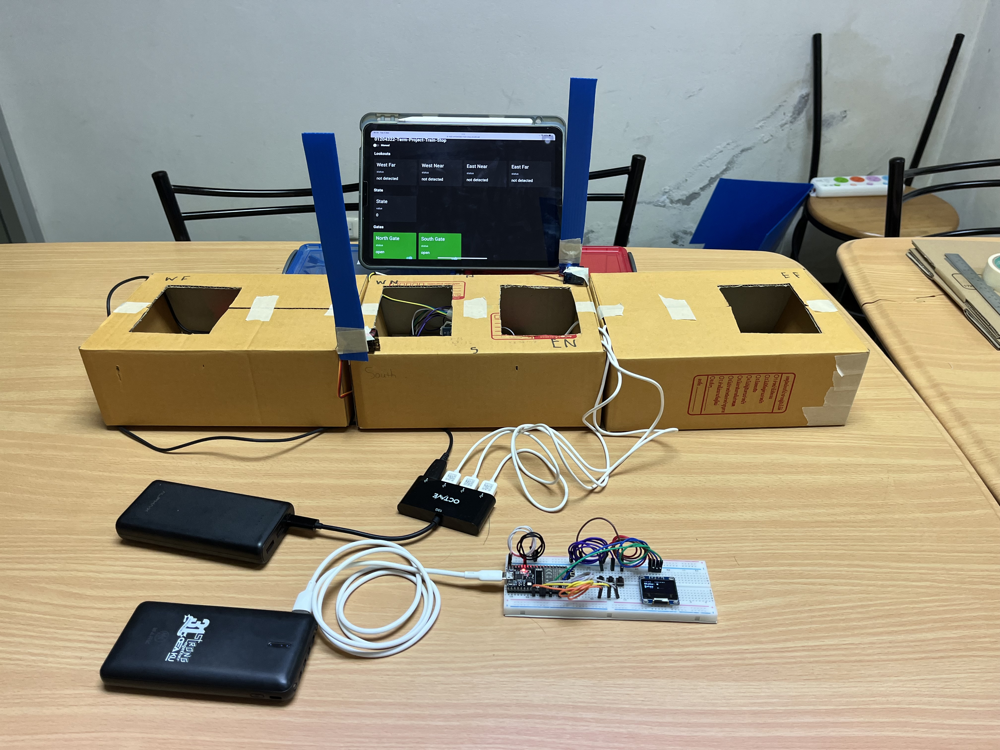
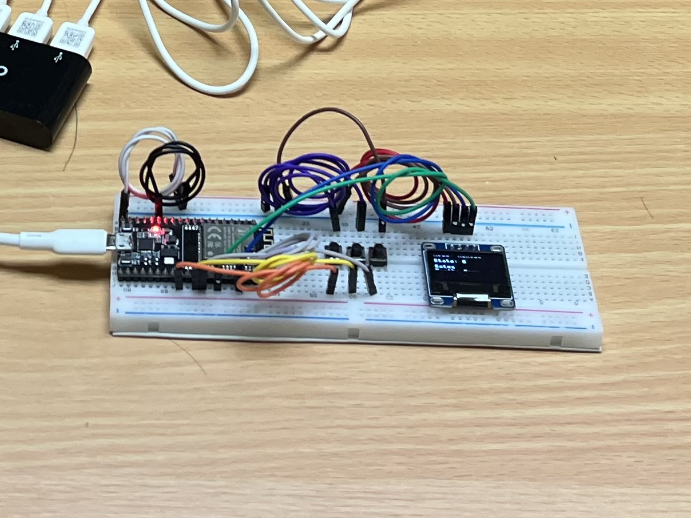
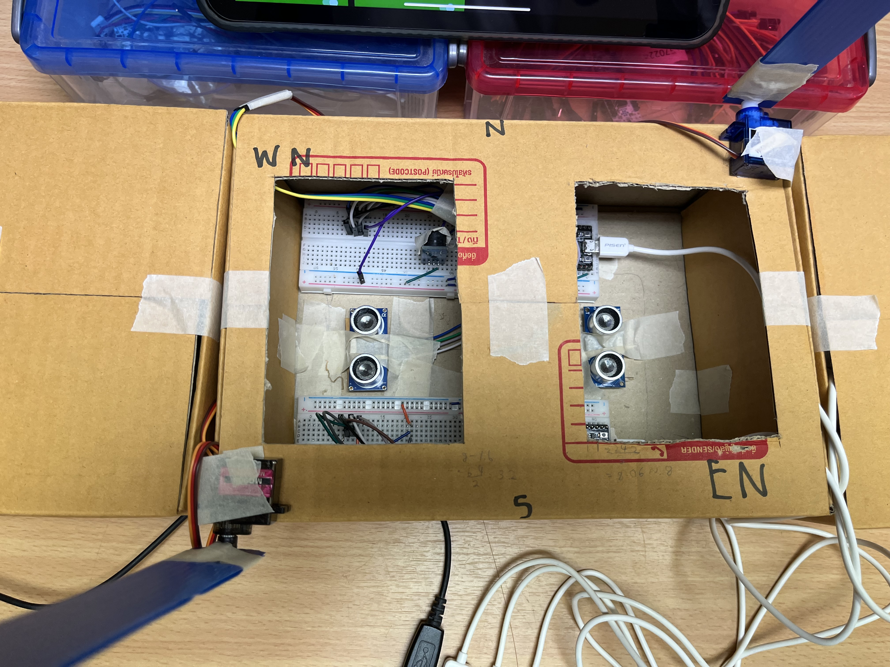
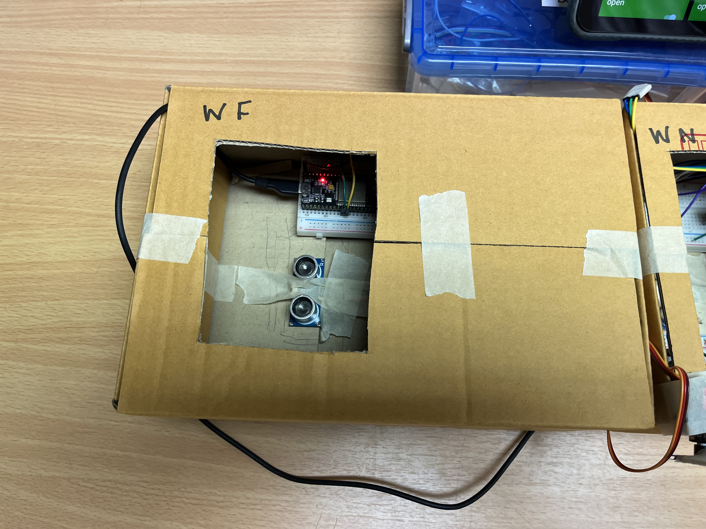
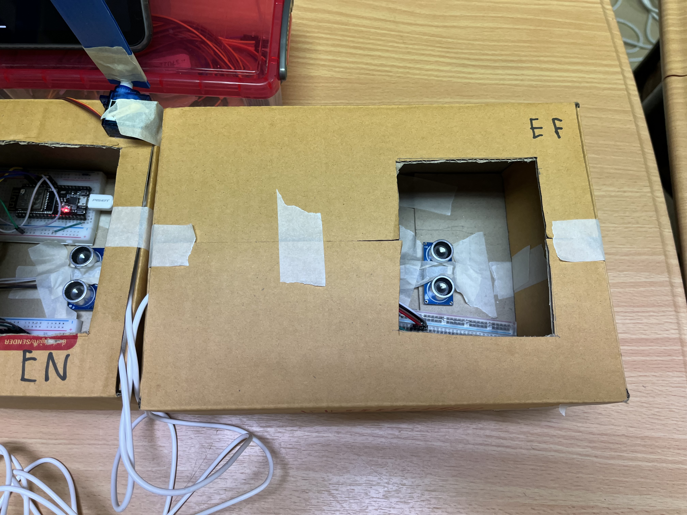

# งาน Project กลุ่ม หยุดก่อน รถไฟมาแล้ว

## รายชื่อสมาชิกกลุ่ม

- 6410504047 ชาญฤทธิ์ พิศิษฐ์จริง
- 6410504110 ธิติ วิรัตกพันธ์
- 6410504136 นราวิชญ์ สฤษฎีชัยกุล
- 6410504195 พีรศุ พุทธกูล
- 6410504250 รชต พีระนันทืรังษี

## คำอธิบาย Project

เป็นการออกแบบระบบควบคุมการเปิดปิดของไม้กั้นรถไฟ ให้สอดคล้องกับระยะห่างของรถไฟที่กำลังมาถึงเเละรถที่กำลังวิ่งผ่านรางรถไฟ เพื่อให้รถจอดรอรถไฟด้วยระยะเวลาที่พอดีและไม่เกิดอุบัติเหตุ

## ที่มาและความสำคัญ

&nbsp;&nbsp;&nbsp;&nbsp;&nbsp;&nbsp;ในยุคปัจจุบัน การเดินทางด้วยรถไฟนั้นเป็นที่นิยมและแพร่หลายไปยังทุกพื้นที่ทั่วโลก  ความนิยมในการเดินทางด้วยรถไฟนี้มาพร้อมกับรางรถไฟที่ถูกสร้างขึ้นมาในหลายพื้นที่ และรางรถไฟบางส่วนก็มีความจำเป็นที่จะต้องตัดผ่านถนน จึงทำให้มีการสร้างทางข้ามทางรถไฟขึ้นมา ซึ่งทางข้ามทางรถไฟก็มาพร้อมกับความเสี่ยงของอุบัติเหตุการชนกันของรถยนต์และรถไฟ

&nbsp;&nbsp;&nbsp;&nbsp;&nbsp;&nbsp;มาตรการการลดความเสี่ยงของการเกิดอุบัติเหตุดังกล่าวก็คือการใช้ไม้กั้นทางรถไฟเมื่อรถไฟกำลังจะวิ่งผ่านทางข้ามทางรถไฟ แต่ในปัจจุบัน หลาย ๆ ทางข้ามทางรถไฟยังคงมนุษย์ในการควบคุมอยู่ หรือในพื้นที่ห่างไกลก็ไม่มีไม้กั้นหรือคนมาควบคุมเลย ด้วยเหตุนี้ ทางคณะผู้จัดทำโครงงานจึงเล็งเห็นถึงโอกาสในการพัฒนาระบบไม้กั้นทางรถไฟอัตโนมัติ เพื่อช่วยลดโอกาสการเกิดอุบัติเหตุ และช่วยแบ่งเบาภาระที่มนุษย์จะต้องควบคุมไม้กั้นทางข้ามทางรถไฟ

## ฟีเจอร์ที่สำคัญ 

- มีเซนเซอร์ Ultrasonic ที่สามารถตรวจสอบได้ว่า รถไฟมาจากทางไหน และ ยาวกี่ขบวน
- ไม้กั้นที่สามารถเปิดปิดได้อัตโนมัติ หรือ ควบคุมเอง พร้อมกับเสียงเตือนจากลำโพง Buzzer
- สามารถควบคุมไม้กั้นได้ผ่านหน้าเว็บไซต์ http://mqtt.embedded-train-stop.dynv6.net/ หรือ บน Control Board พร้อมหน้าจอ OLED เพื่อแสดงผลสถานะของไม้กั้นและ Mode ที่ใช้
- มีโหมด Auto และ Manual สำหรับการควบคุมไม้กั้น

## แนวคิดและหลักการ

### บอร์ดที่ 1 Control Board

 

- หน้าจอ OLED ที่แสดงผลสถานะของไม้กั้นและ Mode ที่ใช้
- ควบคุมสถานะเริ่มต้นที่ใช้สำหรับการสื่อการกับบอร์ดที่เหลือ (Ultrasonic, Gate Servo) ผ่านปุ่ม 3 ปุ่ม

### บอร์ดที่ 2,3 Ultrasonic Board

- มี Sensor Ultrasonic ที่ใช้วัดระยะโดยนำมาประยุกต์เมื่อมีรถไฟเข้ามาจะทำให้ระยะลดลง เมื่อต่ำกว่าระยะที่ได้กำหนด (น้อยกว่า 10 cm) จะทำการส่ง message ไปยัง topic `crossing1/lookouts`
- โดย message ที่กำหนดมีดังนี้
- `1` เมื่อระยะต่ำกว่าที่กำหนด (มีรถไฟผ่าน) , `0` เมื่อไม่มีรถไฟผ่าน

### บอร์ดที่ 4,5 Gate Servo Ultrasonic

- มี Sensor Ultrasonic ที่ใช้วัดระยะโดยนำมาประยุกต์เมื่อมีรถไฟเข้ามาจะทำให้ระยะลดลง เมื่อต่ำกว่าระยะที่ได้กำหนด (น้อยกว่า 10 cm) จะทำการส่ง message ไปยัง topic crossing1/lookouts
- โดย message ที่กำหนดมีดังนี้
- `1` เมื่อระยะต่ำกว่าที่กำหนด (มีรถไฟผ่าน) , `0` เมื่อไม่มีรถไฟผ่าน
- มี Servo ที่ใช้แทนไม้กั้นโดยจะรอรับข้อความจาก topic `crossing1/gates` โดยให้ `0` แทนไม้กั้นปิด `1` แทนไม้กั้นเปิด
- มีลำโพง Buzzer ที่จะทำงานเมื่อไม้กั้นปิด `crossing1/gates = 0`

### Protocol ที่ใช้ในการสื่อสารระหว่าง Board

- MQTT โดยผ่านการเปิด Broker เองโดยสามารถใช้งานได้ผ่าน `mqtt://mqtt.embedded-train-stop.dynv6.net` พร้อมกับ username + password เพื่อจำกัดการเข้าถึง และ ความปลอดภัย และ มี topic ที่ใช้ดังนี้

# MQTT Topics

**ENABLE RETAIN MESSAGE FOR ALL TOPICS!!**

## Lookouts สำหรับบอร์ด Ultrasonic และ Gate Servo Ultrasonic

spontaneous report

- publishers
  - sensor boards (process value from sensor and publish on change)
- subscribers
  - control board (subscribe and save locally for control logic)
  - web ui (subscribe and save locally for display)

### Topics

- crossing1/lookouts/west/far
- crossing1/lookouts/west/near
- crossing1/lookouts/east/near
- crossing1/lookouts/east/far

### Values

- "0" => not detected
- "1" => detected

## State สำหรับ Control Board

spontaneous report

- publishers
  - control board (save locally for control logic, display, and publish on change)
- subscribers
  - web ui (subscribe and save locally for display)

### Topics

- crossing1/state

### Values

- "0", => no train
- "eb0", "eb1", "eb2", "eb3", "eb4", "eb5", => train going east
- "wb0", "wb1", "wb2", "wb3", "wb4", "wb5" => train going west

## Gates สำหรับบอร์ด Gate Servo Ultrasonic

spontaneous command

- publishers
  - control board (save locally for display and publish on auto/manual gate control command)
  - web ui (save locally for display and publish on manual gate control command)
- subscribers
  - gate boards (subscribe and save locally for servo, buzzer, and LED control)
  - control board (subscribe and save locally for display)
  - web ui (subscribe and save locally for display)

### Topics

- crossing1/gates/north
- crossing1/gates/south

### Values

- "0" => close
- "1" => open

## Mode สำหรับ Control Board

spontaneous command

- publishers
  - control board (save locally for control logic, display, and publish on manual mode change command)
  - web ui (save locally for manual gate control, display, and publish on manual mode change command)
- subscribers
  - control board (subscribe and save locally for control logic and display)
  - web ui (subscribe and save locally for manual gate control and display)

### Topics

- crossing1/mode

### Values

- "A" => Auto
- "M" => Manual

- *เพิ่มเติม การ publish ข้อความจะมีการทำ retain เพื่อให้บอร์ดหรือเว็บไซต์ที่พึ่งทำการ subscribe topic ใหม่ได้เห็นข้อความล่าสุดเสมอ 
- Websocket ใช้สำหรับการแสดงผลแบบ realtime ผ่านหน้าเว็บไซต์สามารถเชื่อมต่อได้ผ่าน `wss://mqtt.embedded-train-stop.dynv6.net` พร้อมกับ username + password
  

## Development Tools

- ESP32 microcontroller สำหรับการทำ project
- Thonny (ใช้สำหรับพัฒนา program สำหรับ board ESP32)
- Visual Studio Code + Vite (สำหรับพัฒนาหน้าเว็บไซต์)
- wokwi (สำหรับการวาดรูปแผนผังวงจรที่ใช้งานสำหรับการพัฒนา Project)

## รูปผลงานทั้งหมด

