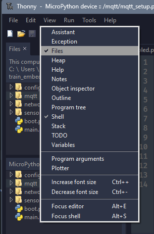
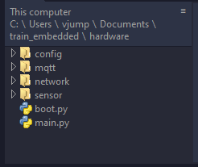
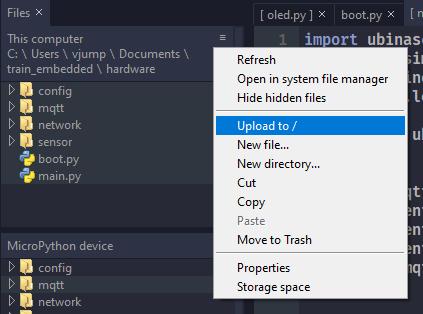
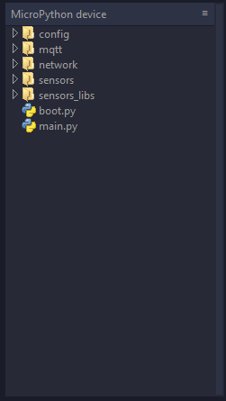

# งาน Project กลุ่ม หยุดก่อน รถไฟมาแล้ว

## คำอธิบาย Project

เป็นการออกแบบระบบควบคุมการเปิดปิดของไม้กั้นรถไฟ ให้สอดคล้องกับระยะห่างของรถไฟที่กำลังมาถึงเเละรถที่กำลังวิ่งผ่านรางรถไฟ เพื่อให้รถจอดรอรถไฟด้วยระยะเวลาที่พอดีและไม่เกิดอุบัติเหตุ

## วิธีใช้งาน

- เปิด Thonny แล้วเปิด tab file explorer ตรงนี้



- เปิด folder repo นี้ขึ้นมา



<small>*ค่อยๆ double click ไปเรื่อยๆ จนเปิด folder project ได้</small>

- เลือกไฟล์ทั้งหมด (กด shift + file และ folder ทั้งหมด) -> กด `Upload to /`




- ไฟล์ก็จะถูก upload ลงบน esp32



- กดปุ่ม reboot บน board esp32

## Project Structure (ส่วน Hardware)

```
main_hardware
│   boot.py
│   main.py
│
├─── config
│       load_config.py
│
├─── mqtt
│       mqtt_setup.py
│
├─── network
│       wifi_connect.py
│
├─── sensors
│       oled.py
│       servo_test.py
│       ultrasonic.py
│
└─── sensors_libs
        hcsr04.py
        servo.py
        ssd1306.py
```
## คำอธิบาย Project Structure

- `boot.py` ทำงานเมื่อ esp32 เริ่มทำงาน โดยจะมีการทำงานดังนี้
- `main.py` จะทำงานเมื่อหลัง `boot.py` ทำงานเสร็จสิ้น (แก้ไขได้)
- `config.py` เป็นรวมการตั้งค่าต่างๆ 
- `mqtt_setup.py` เป็นไฟล์ที่มี function setup mqtt ที่ใช้ต่อไปยัง MQTT Broker เรียบร้อยแล้ว
- folder `sensors` เป็นรวมไฟล์ sensors ที่เชื่อมต่อเรียบร้อยแล้ว (เรียกตัวแปรมาพร้อมใช้งานเลย)
- folder `user_lib` รวม library ต่างๆ ที่โหลดจากเน็ต
 

## คำแนะนำในการใช้งาน

- แนะนำให้อัพโหลด code ใน folder `main_hardware` ลงไปยัง board ก่อนแล้วค่อยแก้ไขไฟล์ต่างๆ
- หากต้องการเรียก library sensors แต่ละตัว ให้ดูจาก folder `sensors_lib`
- หากต้องการใช้ sensors ที่เชื่อมต่อ port และมี function ที่พร้อมใช้งาน ที่ต้องการแล้วให้ดูจาก folder `sensors`

## ข้อควรระวัง

- อย่าแก้ไขไฟล์อะไรบน folder main_hardware นะ
- หากต้องการเขียน code ในเครื่องตัวเอง ให้ copy ทั้ง folder main_hardware มาทั้งหมด ใส่ไปที่ Hardware และ เปลี่ยนชื่อ folder ด้วยนะ
- ไฟล์ config อย่าแก้ไขค่าต่างๆในคอมตัวเอง แล้ว push ขึ้น github นะ (ระวังรหัส wifi หลุด)
- อย่าตั้งชื่อ file ใน folder hardware ทีทำงานซ้ำกันนะ (ตอน `sys.path.append` มันจะทับกันเอง)
    
## การจัดการ repo นี้

- แยก branch ก่อนเสมอนะ !!!!!!!!!
- ถ้าเขียน code ของแต่ละบอร์ดเสร็จแล้วก็ทำ folder ใน hardware แล้วช่วยระบุหน่อยว่า อันนี้คือ board ทำหน้าที่อะไร (แบบตั้งชื่อ folder ก็พอ) เช่น บอร์ดนี้อ่าน ultrasonic ตัวที่ 1 ให้เปิด folder แบบนี้ `/hardware/ultrasonic_board_1` และก็ export ออกมาจาก board ใส่เข้าไปยัง folder ที่สร้างเอาไว้
- format code ไม่ต้องก็ได้เพราะว่า Thonny กาก...
- pull request คิดว่าเรียบร้อยแล้ว (คนอื่นกด approve ได้นะ ไม่ใช่ vjump คนเดียว)

## Known issues

- ไฟล์ `boot.py` เมื่อ upload ลงไปยัง esp32 แล้ว อาจจะไม่สามารถเปิดแก้ไขจากบอร์ด esp32 ได้ (ต้องแก้ไฟล์ในเครื่องแล้ว upload ทับลงไป)
- เนื่องจาก micropython ไม่สามารถ import ผ่าน folder/directory ได้จึงต้องใช้ `sys.path.append` ในการเพิ่ม directory ต่างๆ เข้าไปแทน และการ import module ต่างๆ จึงเหมือนกับว่าทุกๆไฟล์อยู่ folder/directory เดียวกัน 